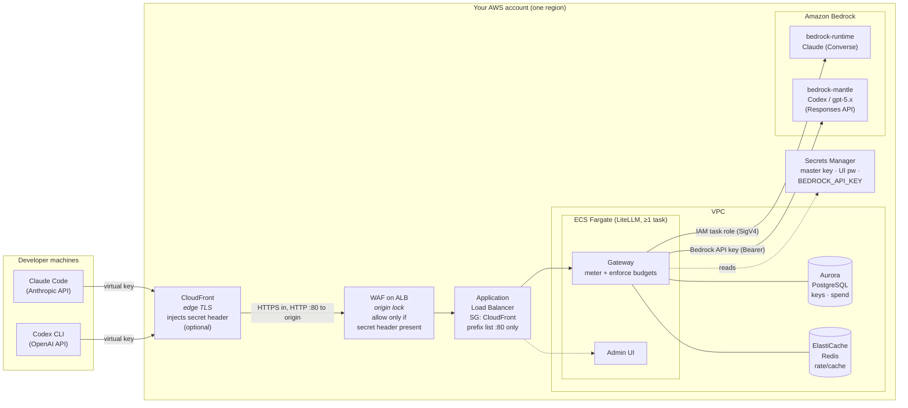

# Architecture (maintainer reference)

Internal reference for maintainers. For install/administer/use, start at the
[README](../../README.md).

What you deploy into **your own AWS account**: an inline LiteLLM gateway that
meters every request and enforces per-user dollar budgets in front of Amazon
Bedrock (Claude) and Bedrock Mantle (Codex / OpenAI frontier models).

Everything runs in one account/region. Deployed with LiteLLM's official AWS
Terraform module (ECS Fargate + Aurora PostgreSQL + ElastiCache Redis + ALB),
wrapped by this repo's `deploy/` scripts.

## Request path

## What each piece does

| Component | Role |
|-----------|------|
| **CloudFront** *(optional)* | Public HTTPS entrypoint. Terminates TLS at the edge (default `*.cloudfront.net` cert — no ACM cert or DNS to start), reaches the origin over HTTP :80, and injects a secret `X-Origin-Verify` header. |
| **WAF on ALB** *(with CloudFront)* | A regional WAFv2 WebACL associated to the ALB that **blocks any request missing the secret header** — the origin lock. Paired with the SG (below), only this CloudFront distribution can reach the ALB. It does not touch the module's path-routing rules. |
| **ALB** | Routes to the gateway / admin UI. With CloudFront, its security group admits only the CloudFront origin-facing managed prefix list on port 80. Without CloudFront, ingress is locked to an explicit IP allowlist (`alb_ingress_cidrs`). |
| **ECS Fargate — Gateway** | The inline LiteLLM proxy. Authenticates the per-user **virtual key**, meters tokens, and **enforces the dollar budget** (rejects over-cap requests). |
| **ECS Fargate — Admin UI** | Web UI to manage keys, teams, budgets, spend, and models (`<GATEWAY_URL>/ui`). |
| **Aurora PostgreSQL** | Stores virtual keys, teams, users, budgets, and the spend ledger. |
| **ElastiCache Redis** | Rate limiting and caching. |
| **Secrets Manager** | Master key, UI password, and the Codex/Mantle `BEDROCK_API_KEY` (12h TTL — auto-refreshed, see below). |
| **bedrock-runtime** | Claude models via the Converse API. The gateway authenticates with its **IAM task role (SigV4)** — no per-model secret. |
| **bedrock-mantle** | Codex / gpt-5.x via the OpenAI Responses API. The gateway authenticates with a **Bedrock API key (Bearer)**, because LiteLLM's `openai/` provider does not SigV4-sign this leg. |

## Two auth legs (why they differ)

- **Claude → bedrock-runtime:** the ECS task role signs requests with SigV4. Nothing to rotate.
- **Codex → bedrock-mantle:** requires a short-lived **Bedrock API key** (Bearer
  token), because LiteLLM's Mantle route can't SigV4-sign in the pinned version.
  The key lives in Secrets Manager and expires in ~12h — so this repo ships an
  **auto-refresher** (`enable_codex_key_refresh = true`): a scheduled Lambda mints
  a fresh token from its own Bedrock-scoped role, writes the secret, and rolls the
  gateway every 6h. No manual rotation. See
  [codex-key-refresher.tf](../../deploy/codex-key-refresher.tf). (When LiteLLM's
  `bedrock_mantle` SigV4 auth works, Codex can use the task role like Claude and
  the refresher can be removed.)

## Ingress hardening (two options)

The upstream module opens the ALB to `0.0.0.0/0`; this repo does **not** leave it
that way:

1. **IP allowlist** (default) — `deploy.sh` reconciles the ALB security group to
   the CIDRs in `alb_ingress_cidrs` after every apply.
2. **CloudFront origin lock** (`enable_cloudfront = true`) — adds edge TLS and
   restricts the ALB two ways: its SG admits only the CloudFront origin-facing
   prefix list (:80), and a WAF on the ALB blocks anything without the secret
   `X-Origin-Verify` header CloudFront injects, so the ALB is not reachable
   directly.

See [docs/installer.md](../installer.md) for the step-by-step install.
